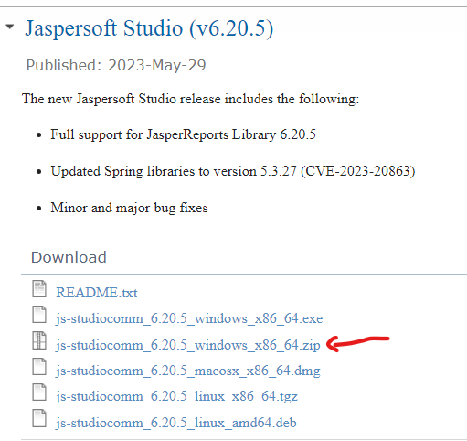
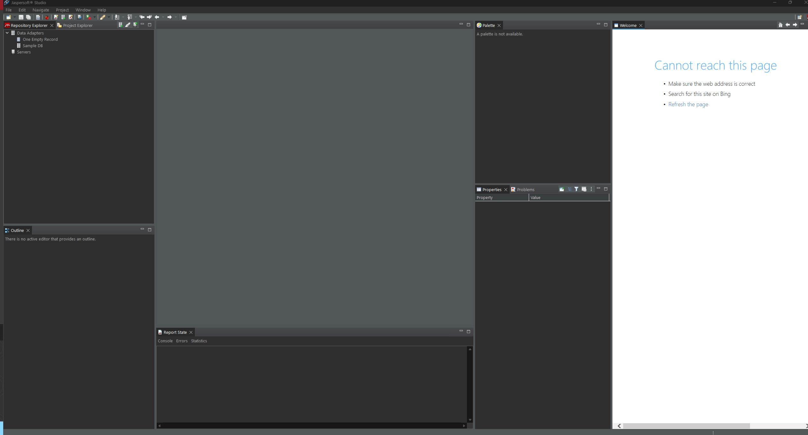
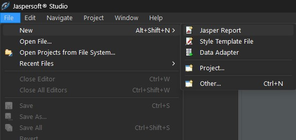
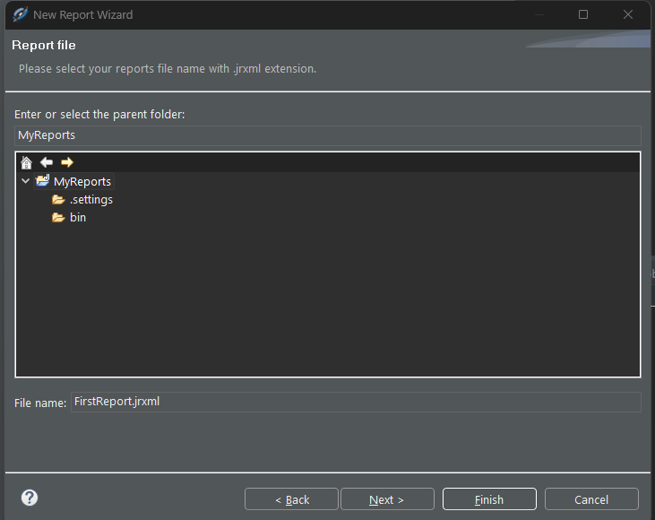
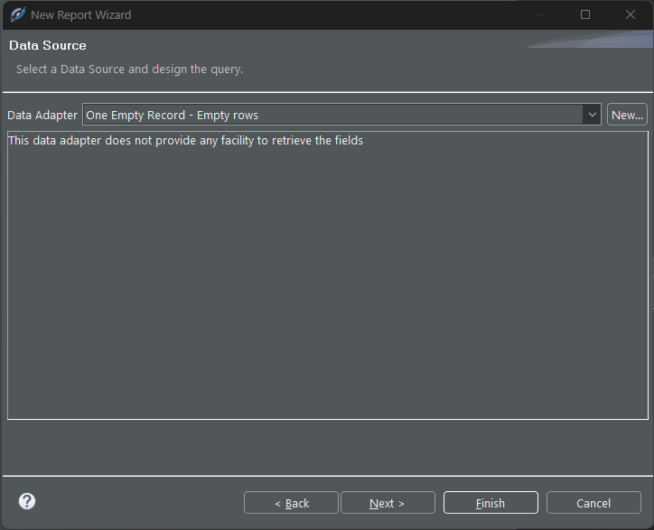

# Learning Jaspersoft

## Tutorial 1

* I follow this youtube tutorial: [Jasper Report Tutorial Part #1 | Download and setup Jasper Studio](https://www.youtube.com/watch?v=FxPrX9ajAgA)

* I download Jaspersoft Studio from [here](https://community.jaspersoft.com/project/jaspersoft-studio/releases)



* I extract the zip to C://Tools

* I open up the .exe in the extracted files. I get the following screen:



* I create a new Jasper Report:



* I select on the blank A4 template and choose my filename:



* I then see a window for the Data source:



* I copy the project into this repo! 

## Tutorial 2

* I follow this youtube tutorial: [Using XML Data sources in Jasper Report | Jasper soft Studio](https://www.youtube.com/watch?v=LG8fZC3H3Us)

* I create an XML file ([here](/MyReports/SampleForReport.xml)) for this report:

```xml
<CATALOG>
    <CD>
        <TITLE>Sleeping with Ghosts</TITLE>
        <ARTIST>Placebo</ARTIST>
        <COUNTRY>UK</COUNTRY>
        <COMPANY>Sony Music</COMPANY>
        <PRICE>8.95</PRICE>
        <YEAR>2003</YEAR>
    </CD>
    <CD>
        <TITLE>Life After</TITLE>
        <ARTIST>Palace</ARTIST>
        <COUNTRY>UK</COUNTRY>
        <COMPANY>Sony Music</COMPANY>
        <PRICE>8.95</PRICE>
        <YEAR>2019</YEAR>
    </CD>
    <CD>
        <TITLE>Madvillainy</TITLE>
        <ARTIST>MF DOOM</ARTIST>
        <COUNTRY>USA</COUNTRY>
        <COMPANY>Eros Music</COMPANY>
        <PRICE>9.95</PRICE>
        <YEAR>2004</YEAR>
    </CD>
    <CD>
        <TITLE>Twilight</TITLE>
        <ARTIST>Boa</ARTIST>
        <COUNTRY>UK</COUNTRY>
        <COMPANY>Warner Bros Music</COMPANY>
        <PRICE>6.95</PRICE>
        <YEAR>2001</YEAR>
    </CD>
    <CD>
        <TITLE>Loud Like Love</TITLE>
        <ARTIST>Placebo</ARTIST>
        <COUNTRY>UK</COUNTRY>
        <COMPANY>Sony Music</COMPANY>
        <PRICE>8.95</PRICE>
        <YEAR>2013</YEAR>
    </CD>
</CATALOG>
```

* I create a new report and set the Data Source using the above XML - I check the box to use XPath within the report:


* Clicking finish updates the Data Source wizard:


* I specify the nodes of where the data is being provided:


* I click on next and see the Field window:


* I move the required fields to the RHS:


* I click next which displays the Group By window but I don't want any groupings. So I click next and Finish

* I get to the report editor:


* I dragged all the fields from the LHS, into the Detail 1 section like so:


* This adds the name of the fields and their values!

* I click on the preview tab and see the following:


* I wonder why I'm only seeing one row of data, googling leads me to [this stackoverflow article](https://stackoverflow.com/questions/34759035/why-only-one-row-is-showing-in-report)

* I realise that my fields are in the Column header band when it SHOULD be in the detail band. I correct this in the design tab:


* Clicking on the Preview tab now shows me:

